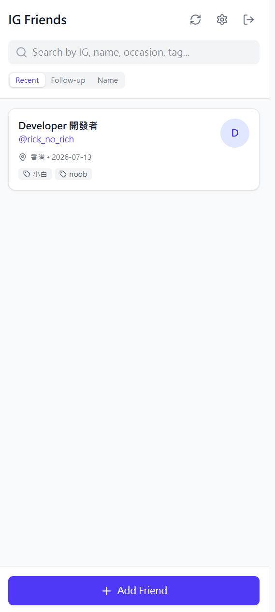
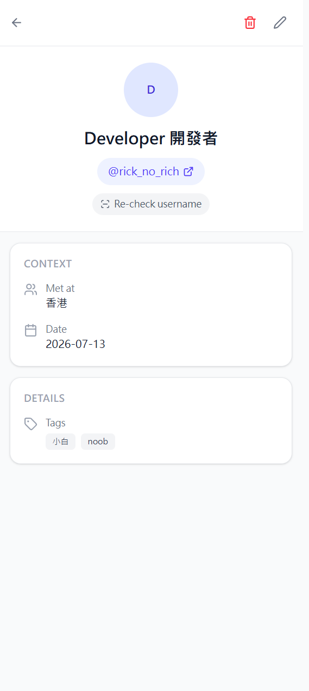

# 👋 IG Friends Tracker

**A privacy-first personal CRM for the people you meet on Instagram — your data lives in your own Google Sheet, not on anyone's server.**

Met someone great at an event, followed each other on Instagram… and three weeks later you can't remember who they are? IG Friends Tracker gives every new connection a memory: where you met, what you talked about, and when to follow up.

[中文使用說明 → USAGE_zh.md](USAGE_zh.md)

## Screenshots

| Dashboard | Friend details |
|---|---|
|  |  |

## Why it's different

- **You own the data.** Every record is stored in a Google Sheet named *IG Friends Database* inside **your own Google Drive**. There is no backend and no third-party database — the app literally cannot see your data.
- **Survives username changes.** Instagram handles change; the numeric user ID never does. Save the ID once and the app keeps a full username history ("also known as @old_name"), so a rename never breaks your records.
- **Installable PWA.** Add it to your phone's home screen and it opens like a native app.

## Features

- 🔐 Google sign-in (Firebase Auth) — data syncs to a sheet the app creates in *your* Drive
- 📝 Rich friend records: occasion, date, location, tags, notes, follow-up reminder
- 🖼️ Avatar upload — photos are resized in the browser and stored inside the sheet, so they never expire
- 🆔 Permanent Instagram User ID anchoring + automatic username-change history
- 🔎 Search (including past usernames), clickable tag filters, sort by recent / follow-up / name
- ⏰ Follow-up badges ("Today", "3d late") right on the dashboard
- 📱 Installable PWA with offline shell
- ⚡ Optional: bring your own [Apify](https://apify.com) token to auto-fetch IDs and re-check renames — the token stays in *your* browser only

## Tech stack

React 19 · TypeScript · Vite · Tailwind CSS 4 · Firebase Authentication · Google Sheets & Drive API (`drive.file` scope only) · PWA

No server. The whole app is static files talking directly to Google APIs with the signed-in user's own token.

## Project structure

```
├── public/              # PWA manifest, service worker, icons
├── src/
│   ├── components/      # IgAvatar, AvatarUploadField, InstagramIdField
│   ├── lib/             # api.ts (Sheets), firebase.ts (auth), apify.ts, identity.ts, image.ts
│   ├── pages/           # Dashboard, AddFriend, EditFriend, FriendDetails, Settings, Privacy
│   └── App.tsx          # Routes + auth gate
├── vercel.json          # SPA rewrites for deployment
└── .env.example         # Firebase config template
```

## Getting started (run your own copy)

> **Just want to use the app?** If someone shared a deployed link with you, simply open it and sign in with Google — no setup needed. The steps below are only for developers hosting their own instance.

**Prerequisites:** Node.js 18+ and a free Google account.

### 1. Clone and install

```bash
git clone https://github.com/rickuuyu-create/ig-friends-tracker.git
cd ig-friends-tracker
npm install
```

### 2. Create your (free) Firebase project

This app authenticates with *your* Firebase project so that your users' data goes to *their* Drive.

1. Go to <https://console.firebase.google.com> → **Add project**.
2. Click the Web icon **`</>`** → register a web app → copy the `firebaseConfig` values.
3. **Authentication → Sign-in method → Google → Enable** (pick a support email).
4. Enable two APIs in Google Cloud Console for the same project:
   [Google Sheets API](https://console.cloud.google.com/apis/library/sheets.googleapis.com) and
   [Google Drive API](https://console.cloud.google.com/apis/library/drive.googleapis.com).
   *Skipping this step is the #1 cause of "Failed to save" errors.*

### 3. Configure environment variables

```bash
cp .env.example .env.local
```

Fill in the six `VITE_FIREBASE_*` values from step 2. These are public client identifiers, not secrets — access is protected by Firebase authorized domains and the OAuth consent screen.

### 4. Run

```bash
npm run dev
```

Open <http://localhost:3000> and sign in. On first save, the app creates the *IG Friends Database* sheet in your Drive automatically.

## Deploy to Vercel

1. Push this repo to GitHub, then import it in [Vercel](https://vercel.com) (Vite is auto-detected; `vercel.json` handles SPA routing).
2. Add the six `VITE_FIREBASE_*` variables under **Project → Settings → Environment Variables** and redeploy.
3. In Firebase: **Authentication → Settings → Authorized domains** → add `your-app.vercel.app`.
4. To open the app to everyone: in [Google Auth Platform](https://console.cloud.google.com/auth) fill in **Branding** (use `https://your-app.vercel.app/privacy` as the privacy policy URL — the page ships with this app) and click **Audience → Publish app**. The app only uses the non-sensitive `drive.file` scope, so no Google review is required.

## Usage

1. **Add a friend** — username, real name, where you met, tags, notes, optional follow-up date.
2. **Upload an avatar** — resized locally, stored in your sheet, never expires. (Why not auto-fetch from Instagram? IG image URLs are signed and expire within weeks.)
3. **Save the permanent ID** *(recommended)* — tap **Find ID** to look up the numeric Instagram ID for free, paste it in. If the person later renames, your record still identifies them, and the old handle is kept as "Also known as".
4. **Find people fast** — search any field (even past usernames), click a tag to filter, sort by recent / follow-up / name.
5. **Install as an app** — open the deployed site on your phone → "Add to Home Screen".

### Optional: automatic lookups with your own Apify token

In **Settings**, paste a free [Apify](https://console.apify.com/settings/integrations) API token to unlock:

- **Auto-fetch** — fills the Instagram ID (and name) from a username when adding a friend
- **Re-check username** — verifies a friend's handle still belongs to the same account and stamps a "last checked" date

The token is stored only in your browser's localStorage and calls go directly from your browser to Apify. Note: scraping-based lookups can fail temporarily whenever Instagram changes its defenses.

## FAQ

**Where exactly is my data?**
In a Google Sheet called *IG Friends Database* in your own Google Drive. Open it, edit it, export it — it's yours.

**Can the app developer see my records?**
No. There is no server and no analytics. The app requests only the `drive.file` scope, which limits it to files it created in *your* Drive under *your* login.

**Why do I have to paste the Instagram ID manually?**
Instagram blocks anonymous lookups, so a free hosted app can't fetch IDs for everyone. The **Find ID** link makes it a 10-second job — or add your own Apify token for one-tap auto-fetch.

**What happens when a friend changes their username?**
Edit the record with the new handle — the old one is automatically archived and searchable. With an Apify token, **Re-check username** detects the change for you.

**Does it cost anything to run?**
No. Firebase Auth, Google Sheets/Drive APIs (personal volume), Vercel hobby tier, and the PWA are all free.

**How do I delete everything?**
Delete the sheet from your Drive and revoke the app at [myaccount.google.com/permissions](https://myaccount.google.com/permissions).

## Use cases

- Conference / meetup networking — remember every "let's keep in touch"
- Creators & community managers tracking collaborators
- Language exchange / hobby groups where everyone goes by an IG handle
- Anyone who wants a personal CRM without giving their contacts to a SaaS

## Contributing

Issues and pull requests are welcome — see [CONTRIBUTING.md](CONTRIBUTING.md).

## License

[MIT](LICENSE)
